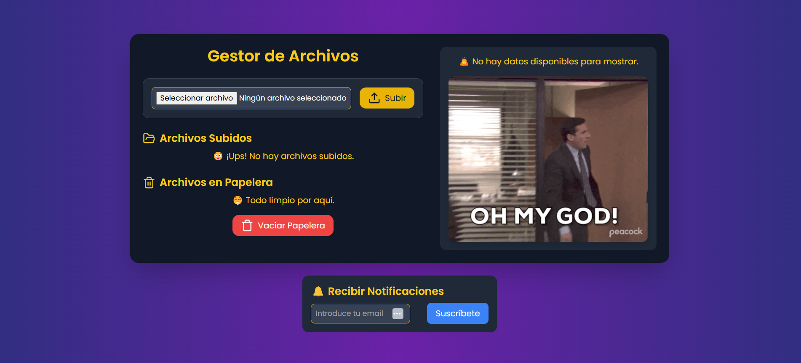
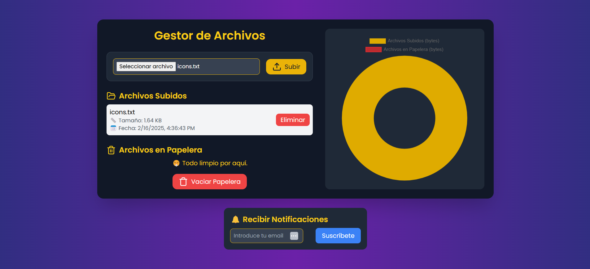
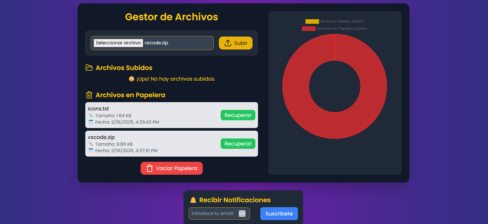
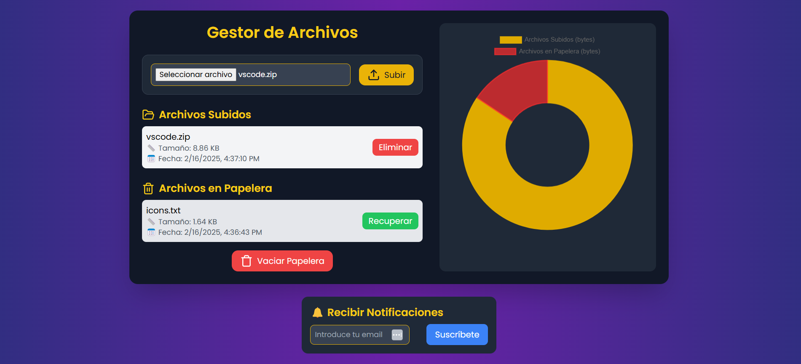
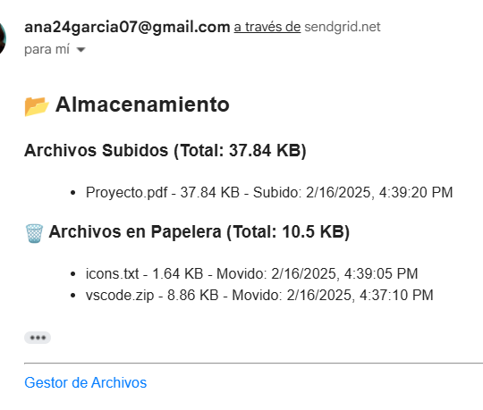

#  Documentación de la Interfaz - Gestor de Archivos


- [Documentación de la Interfaz - Gestor de Archivos](#documentación-de-la-interfaz---gestor-de-archivos)
  - [📖 Introducción](#-introducción)
  - [🚀 Flujo de la Aplicación](#-flujo-de-la-aplicación)
    - [**1️⃣ Vista Inicial**](#1️⃣-vista-inicial)
  - [](#)
    - [**2️⃣ Subida de Archivos**](#2️⃣-subida-de-archivos)
    - [**3️⃣ Mover un Archivo a la Papelera**](#3️⃣-mover-un-archivo-a-la-papelera)
    - [**4️⃣ Restaurar un Archivo de la Papelera**](#4️⃣-restaurar-un-archivo-de-la-papelera)
    - [**5️⃣ Vaciado de Papelera**](#5️⃣-vaciado-de-papelera)
    - [**6️⃣ Suscripción a Notificaciones**](#6️⃣-suscripción-a-notificaciones)
    - [**7️⃣ Recepción de Notificaciones por Correo**](#7️⃣-recepción-de-notificaciones-por-correo)
  - [📁 Creación Automática de Carpetas](#-creación-automática-de-carpetas)
  - [🛠 Levantando el Proyecto](#-levantando-el-proyecto)
    - [**1️⃣ Levantar con Docker**](#1️⃣-levantar-con-docker)
  - [🛠 Autor y Créditos](#-autor-y-créditos)


## 📖 Introducción
El **Gestor de Archivos** es una aplicación que permite la **subida, gestión y eliminación** de archivos, incluyendo una funcionalidad de **papelera de reciclaje** y notificaciones automáticas por correo electrónico sobre el estado del almacenamiento. Su diseño proporciona una interfaz visual intuitiva con gráficos en tiempo real.

---

## 🚀 Flujo de la Aplicación

### **1️⃣ Vista Inicial**
Cuando se carga la aplicación por primera vez, la interfaz se muestra sin archivos subidos ni en la papelera. Se visualiza un mensaje indicando que no hay archivos disponibles y se muestra un gif ilustrativo.


---

### **2️⃣ Subida de Archivos**
El usuario puede seleccionar un archivo y presionar el botón de **subir**.
- Una vez subido, el archivo debería aparecer en la lista de "Archivos Subidos".
- Si el archivo no aparece, es recomendable verificar la consola (`docker-compose up --build` sin `-d`) para ver los `console.log()`.



---

### **3️⃣ Mover un Archivo a la Papelera**
Cada archivo subido tiene un botón de **Eliminar**. Al presionarlo:
- El archivo se moverá a la papelera en lugar de eliminarse permanentemente.
- Se actualizará la gráfica para reflejar la cantidad de archivos en la papelera.





>[!NOTE] **Nota:** Si no se nota diferencia en la gráfica de almacenamiento, puede deberse a que un archivo es demasiado grande en comparación con los demás y su tamaño domina la visualización.

---

### **4️⃣ Restaurar un Archivo de la Papelera**
Los archivos en la papelera tienen un botón **Recuperar**. Al hacer clic:
- Se moverán de vuelta a la lista de "Archivos Subidos".
- La gráfica reflejará el cambio.




---

### **5️⃣ Vaciado de Papelera**
Si se presiona el botón **Vaciar Papelera**, todos los archivos en la papelera se eliminarán de forma permanente.
- Este cambio se reflejará en la gráfica de almacenamiento (desapareciendo).


---

### **6️⃣ Suscripción a Notificaciones**
El usuario puede introducir su correo electrónico en el campo de notificaciones y hacer clic en **Suscribirse**.
- Aparecerá un mensaje indicando que la suscripción fue exitosa.
- Se almacenará el correo en `data/subscribers.json`.


---

### **7️⃣ Recepción de Notificaciones por Correo**
Cada cierto tiempo (5 minutos en versión de pruebas), el sistema enviará un correo con el estado del almacenamiento.
- Se listan los archivos subidos y los que están en la papelera.
- Se indica el tamaño total de cada categoría.



---

## 📁 Creación Automática de Carpetas
El sistema valida que existan las carpetas necesarias y, si no existen, las crea automáticamente:
- **`uploads/`** → Almacena los archivos subidos.
- **`recycled/`** → Guarda temporalmente los archivos eliminados.
- **`data/`** → Contiene `subscribers.json`, donde se almacenan los correos suscritos.

Esto evita errores al ejecutar el proyecto por primera vez.

---

## 🛠 Levantando el Proyecto
### **1️⃣ Levantar con Docker**
Para iniciar el proyecto con Docker, usar el comando:
```sh
docker-compose up --build
```
Si no se usa la opción `-d` (modo detacheado), la terminal mostrará logs detallados de cada acción en el sistema, lo que permite ver el flujo de trabajo.

---

## 🛠 Autor y Créditos
📌 **Desarrollado por:** Ana María García García.

